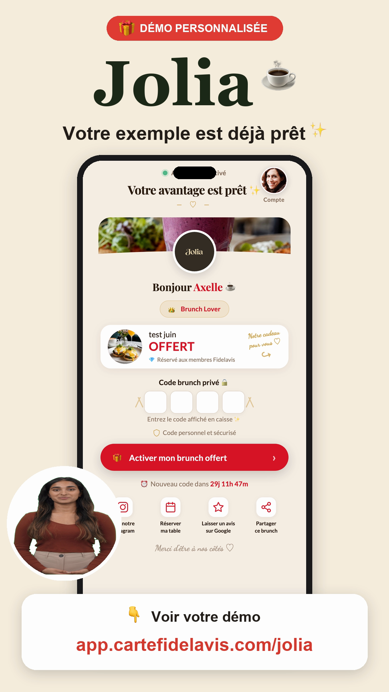
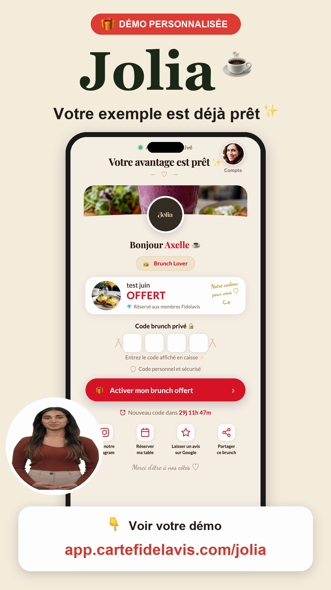
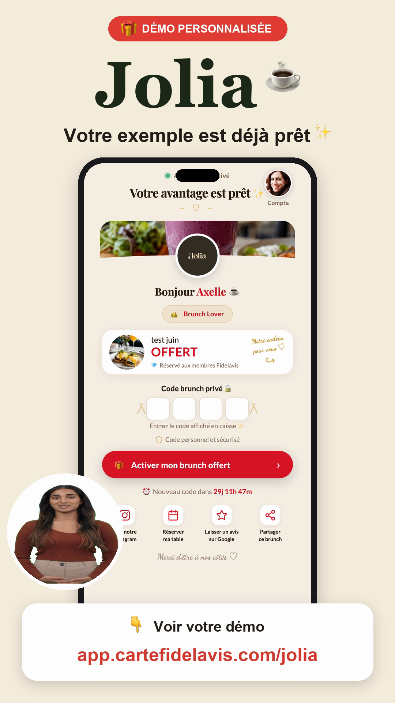
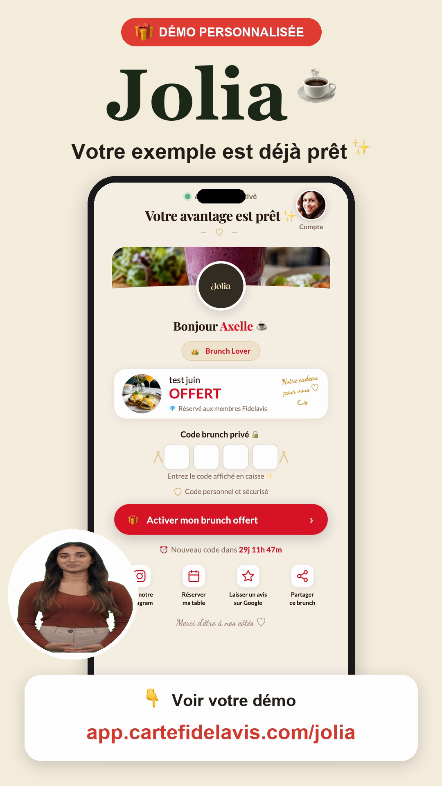
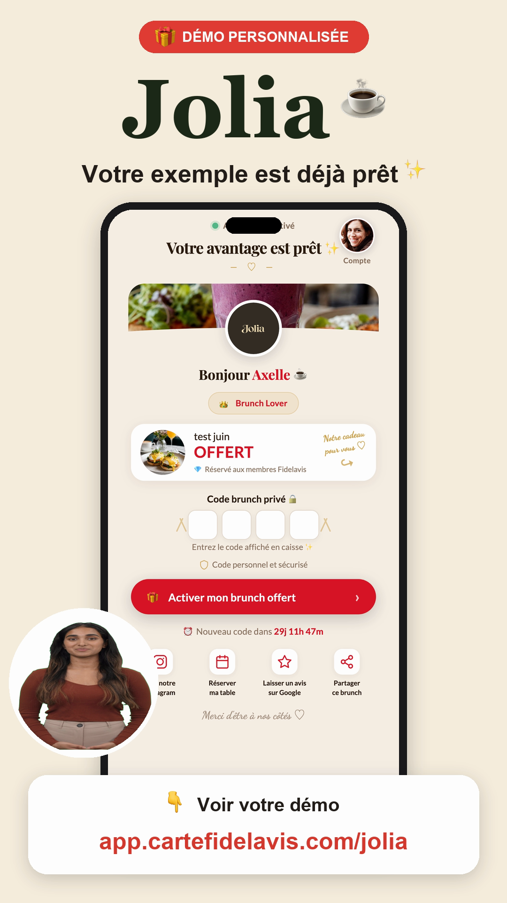
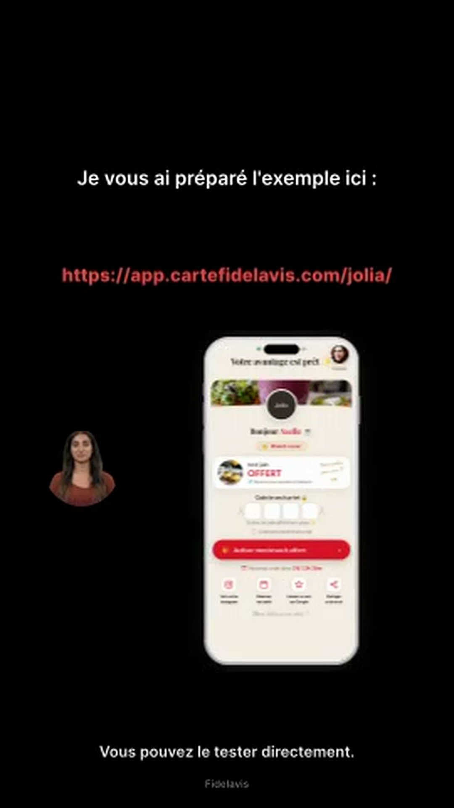

# Rapport de production vidéo — **Jolia**
_Généré le 2026-06-01 à 18:36_

## ✅ Vidéo produite

- **Fichier local** : `dm_videos/jolia-dm.mp4`
- **Poids** : 6.53 MB
- **Durée totale du pipeline** : 10.9 s
- **URL Creatomate (CDN)** : —

## ⏱ Durées

- Script parlé estimé : **~12.4 s** (31 mots)
- Vidéo finale : **18 s** (1080×1920, 30 fps)
- Rendu HeyGen : ~? s
- Rendu Creatomate : ~10.9 s

## 💰 Coût

_(Vérifier les chiffres exacts dans les dashboards HeyGen et Creatomate.)_

- **HeyGen** (durée parlée ≈ 12.4 s) : ~$0.06-0.17 USD
- **Creatomate** (18 s rendus) : ~$0.06-0.15 USD
- **Total estimé** : **~$0.12-0.32 USD**

## 🔑 Identifiants techniques

- HeyGen `video_id` : `—`
- HeyGen `video_url` : https://files2.heygen.ai/aws_pacific/avatar_tmp/288630a07eca49aa87460535cee78838/ada2266c51754317983d2599e8e464f0.mp4?Expires=1780936526&Signature=MXirV9gXvk59fP7WdNs6231Twykrx0qDK0Q0uaAIX6S8jx9fFXwFjXLLWc1pzBIH45s-KDAP-u9plD2t8hlDGSxkNaiB1~tfW5UhCO5rawii6hudFLRVtRIgrziEKn2be3Hn139Rmyl6d~ZPMO9m3WzjqJX7BkjvPp8AR8HoxehfoPbdPy47EEU2JyC9T5wUP~tllC5nFJGot~ORITucJeiJvwXSM468eAtbaF8eh5v8Gdt3m~mVeBD9MHQgJKGhtRlBM6GKw8ZWxKathgDJ~kbE~B6GXADahsGQEAd6M4XA6xdvuEKq-N7kuODkuXBHsJSo9ELLkWCePdzpF6CPew__&Key-Pair-Id=K38HBHX5LX3X2H
- Creatomate `render_id` : `—`

## 🎬 Scènes clés

### t = 1.5 s


### t = 4.5 s


### t = 7.5 s


### t = 11.0 s


### t = 14.0 s


### t = 17.0 s


## 🔗 Liens utiles

- Wallet live : https://app.cartefidelavis.com/jolia/
- Démo (sans inscription) : https://app.cartefidelavis.com/jolia/demo/
- Mockup PNG : https://app.cartefidelavis.com/mockups/jolia-iphone.png

## 📋 Message DM prêt à coller

```
Bonjour Jolia 👋

J'ai préparé une démonstration personnalisée du programme de fidélité Fidelavis pour votre établissement (la vidéo ci-dessus 👆).

Le principe est simple :
• Vos clients scannent un QR code ou une carte NFC
• Ils reçoivent immédiatement une récompense exclusive
• Ils reviennent plus souvent — sans appli à télécharger

🎁 Voir l'aperçu live du wallet : https://app.cartefidelavis.com/jolia/demo/

Si ça vous parle, on peut en discuter en 10 minutes ✨

— L'équipe Fidelavis
```

## ➡️ Suite

Si la vidéo est validée :
```bash
# Générer pour les autres restos
python3 scripts/gen_dm_videos.py brother-sister-brunch-lunch-dinner
python3 scripts/gen_dm_videos.py ter kafkaf-paris-11 deux-restaurant-bistrot-de-chefs
# Ou tous d'un coup
python3 scripts/gen_dm_videos.py
```

