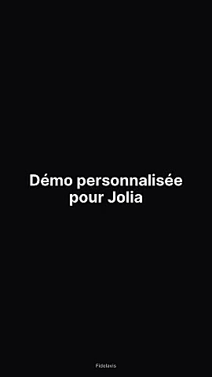
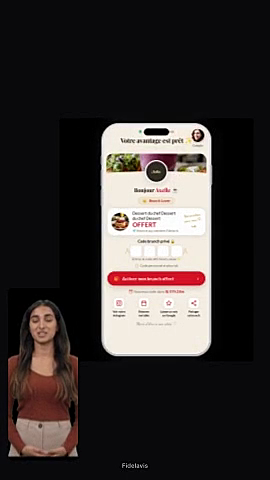
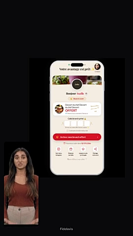
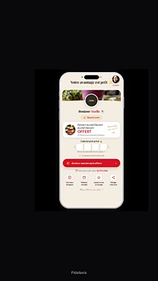
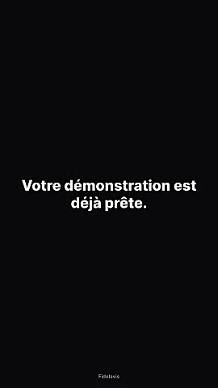

# Rapport de production vidéo — **Jolia**
_Généré le 2026-05-31 à 18:47_

## ✅ Vidéo produite

- **Fichier local** : `dm_videos/jolia-dm.mp4`
- **Poids** : 0.46 MB
- **Durée totale du pipeline** : 38.3 s
- **URL Creatomate (CDN)** : https://f002.backblazeb2.com/file/creatomate-c8xg3hsxdu/08b83e2c-e9aa-47cd-8a8b-1aec55f2940f.mp4

## ⏱ Durées

- Script parlé estimé : **~11.2 s** (28 mots)
- Vidéo finale : **30 s** (1080×1920, 30 fps)
- Rendu HeyGen : ~0 s
- Rendu Creatomate : ~38.3 s

## 💰 Coût

_(Vérifier les chiffres exacts dans les dashboards HeyGen et Creatomate.)_

- **HeyGen** (durée parlée ≈ 11.2 s) : ~$0.06-0.15 USD
- **Creatomate** (30 s rendus) : ~$0.10-0.25 USD
- **Total estimé** : **~$0.16-0.40 USD**

## 🔑 Identifiants techniques

- HeyGen `video_id` : `<reused>`
- HeyGen `video_url` : https://files2.heygen.ai/aws_pacific/avatar_tmp/288630a07eca49aa87460535cee78838/5f1c268c304e40e7b0c45bcedf09971c.mp4?Expires=1780849758&Signature=cCoA8M3s8Ay2xuG66zAt87NH8xMgksHtbdi-Ttg7HqbaF~H6~76oXDZqPSd18YdF8dkHRQIjS1voiDul9h0cL1icQY324AYF2jGfh6TevYrGhFoOla89QLTV5-n1MC5ffXlzXH2G3XTm2q9qUT-qmFFsj4c3i-UxcmoGi8-ZRYx4BGoZohlt96dDzTflUnuZ10hZhiXt-uWFALCGZYaOEDW3195TIghJa6Q1-B~-oB~4-Fu9H-inbAWBo0TWP5t~pdlrcORe1G4QAcSKqVhG8C0Ucb5CxqzgtHawRN9u5Q7b~56j~XIy1irXIGIUynHoZZGn340NsQRDzJCt~Ofhcw__&Key-Pair-Id=K38HBHX5LX3X2H
- Creatomate `render_id` : `08b83e2c-e9aa-47cd-8a8b-1aec55f2940f`

## 🎬 Scènes clés

### t = 1.0 s


### t = 5.0 s


### t = 12.0 s


### t = 20.0 s


### t = 25.0 s


### t = 29.0 s


## 🔗 Liens utiles

- Wallet live : https://app.cartefidelavis.com/jolia/
- Démo (sans inscription) : https://app.cartefidelavis.com/jolia/demo/
- Mockup PNG : https://app.cartefidelavis.com/mockups/jolia-iphone.png

## 📋 Message DM prêt à coller

```
Bonjour Jolia 👋

J'ai préparé une démonstration personnalisée du programme de fidélité Fidelavis pour votre établissement (la vidéo ci-dessus 👆).

Le principe est simple :
• Vos clients scannent un QR code ou une carte NFC
• Ils reçoivent immédiatement une récompense exclusive
• Ils reviennent plus souvent — sans appli à télécharger

🎁 Voir l'aperçu live du wallet : https://app.cartefidelavis.com/jolia/demo/

Si ça vous parle, on peut en discuter en 10 minutes ✨

— L'équipe Fidelavis
```

## ➡️ Suite

Si la vidéo est validée :
```bash
# Générer pour les autres restos
python3 scripts/gen_dm_videos.py brother-sister-brunch-lunch-dinner
python3 scripts/gen_dm_videos.py ter kafkaf-paris-11 deux-restaurant-bistrot-de-chefs
# Ou tous d'un coup
python3 scripts/gen_dm_videos.py
```

